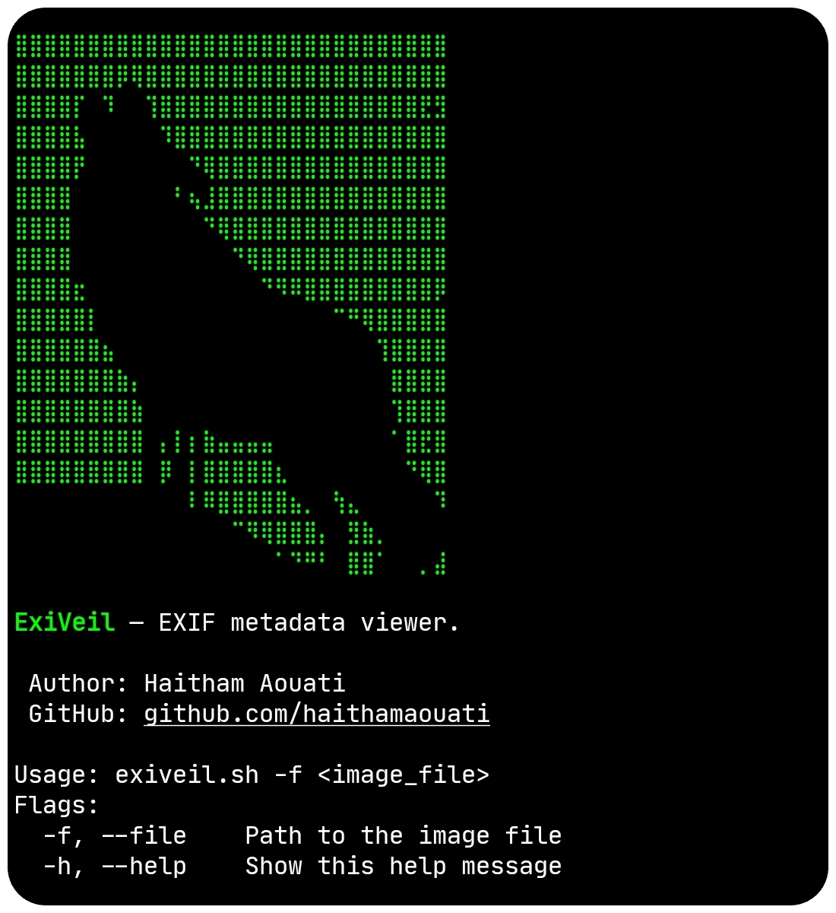

# ExiVeil
ExiVeil — EXIF metadata viewer.



## Install

To use the ExiVeil script, follow these steps:

1. Clone the repository:

    ```
    git clone https://github.com/haithamaouati/ExiVeil.git
    ```

2. Change to the ExiVeil directory:

    ```
    cd ExiVeil
    ```
    
3. Change the file modes
    ```
    chmod +x exiveil.sh
    ```
    
5. Run the script:

    ```
    ./exiveil.sh
    ```

## Usage

Usage: `./exiveil.sh -f <image_file>`

##### Options:

`-f`, `--file`    Path to the image file

`-h`, `--help`    Show this help message

## Dependencies

The script requires the following dependencies:

- **exiv2**: `pkg install exiv2 - y`

Make sure to install these dependencies before running the script.

## Environment
- Tested on [Termux](https://termux.dev/en/)

## Disclaimer
> [!WARNING]
> We are not responsible for any misuse or damage caused by this program. use this tool at your own risk!

## License

ExiVeil is licensed under [WTFPL license](LICENSE).
